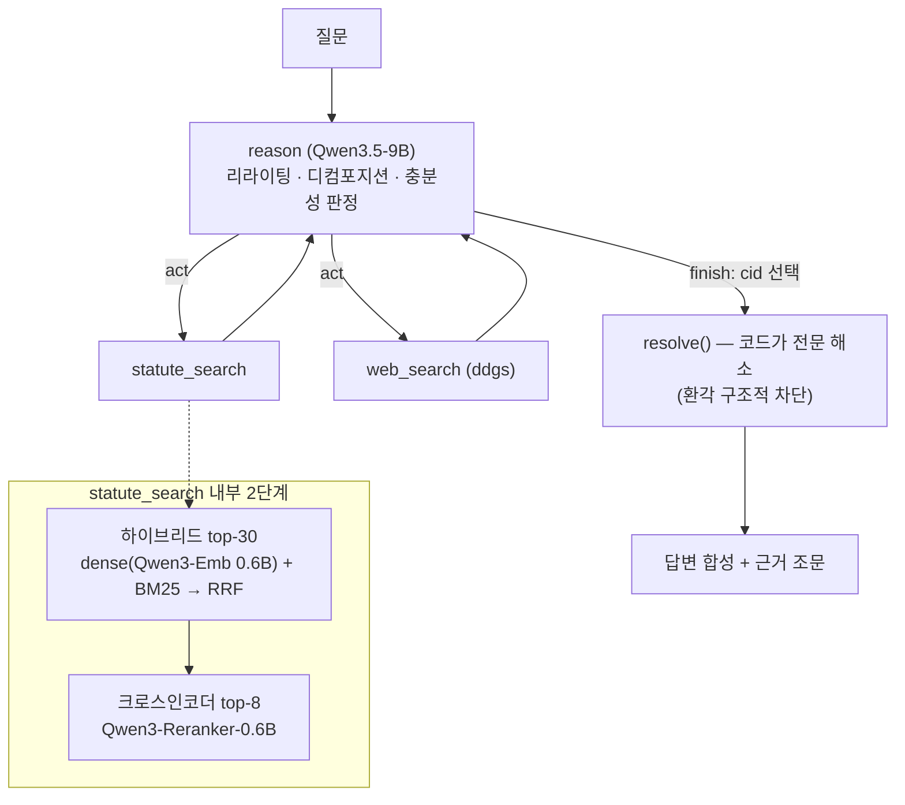

# agentic_rag — 한국 노동법 리트리버 에이전트

**naive → advanced(하이브리드·리랭킹) → agentic(반복 검색·자가 판정) RAG를 한 코드베이스에서 구현하고, 각 단계의 기여를 701쿼리 평가셋으로 실측한 프로젝트.**

사내 HR 컴플라이언스 봇(한국 노동법) 시나리오로 만들었지만, 코드는 코퍼스 무관 — 데이터를 갈아끼우면 그대로 동작합니다. 로컬 GPU 1장(RTX 4090)에서 임베더·리랭커·9B LLM 3모델을 동시 서빙합니다.

```
Q: 육아휴직 기간에도 연차휴가가 발생하나요?
→ 에이전트가 스스로 "육아휴직 중 연차유급휴가 발생"으로 리라이팅
→ 근로기준법 제60조 리랭크 1위 → 제60조⑥ 정확 인용 답변
```

## 핵심 결과 (ablation)

전 조합을 고용노동부 질의회시 기반 **701쿼리 qrels**(조문 단위 정답)로 평가. 전체 표와 해석은 [`docs/ablation_results.md`](docs/ablation_results.md).

| 파이프라인 | R@1 | R@8 | MRR | latency p50 |
|---|---|---|---|---|
| BM25 단독 | 0.136 | 0.238 | 0.292 | 0.01s |
| 하이브리드(RRF) | 0.212 | 0.487 | 0.477 | 0.01s |
| dense 단독 | 0.237 | 0.536 | 0.520 | 0.01s |
| 하이브리드 + 0.6B 크로스인코더 | 0.286 | 0.575 | 0.584 | 0.16s |
| 하이브리드 + 9B LLM 리랭크 | 0.295 | 0.577 | 0.603 | 4.3s |
| + 합집합 리라이팅 (union) | 0.290 | 0.610 | 0.594 | 2.9s |
| **+ 조문 그래프 확장 (struct)** | 0.294 | **0.633** | **0.603** | 3.4s |
| react 에이전트 (v1, max_steps 6) | 0.224 | 0.515 | 0.504 | 112s |

여기에 **kiwi 형태소 BM25**(죽어 있던 sparse 축 부활: 0.238→0.507)를 얹으면
사다리 전체가 한 번 더 이동한다 — hybrid+ce가 **LLM 0회·0.14초로 R@8 0.616**,
최종 struct+ce는 **0.640**. 개선 서사가 이 표의 본체다: 실패 유형을 분해(부수
인용 73.5% / 어휘 갭 / 형태소 무정규화)해서 도출한 레버 세 개 — **합집합
리라이팅**(대체형은 실측 손해, 합집합만 이득), **조문 그래프 동반 확장**("법
제N조" 역참조 정규식으로 위임·벌칙 1,916엣지, LLM 0회), **형태소 BM25** — 가
각각 측정으로 정당화되며 쌓였다.

제품 스코프(조문으로 확답 가능한 질문 26%, LLM 분류)에서는 **핵심 근거 조문
R@8 0.782, 실질 라벨 any-hit@8 0.862**. miss 정독으로 "검색 실패"와 "채점
인공물"(회답 첫 인용 = 목적·적용범위 보일러플레이트)을 분리한 과정은
[`docs/ablation_results.md`](docs/ablation_results.md) 참조.

세 가지 발견:

1. **전용 리랭커는 즉시 값을 한다.** 0.6B 크로스인코더가 MRR +11pp를 쿼리당 0.15초에 산다. 9B LLM 리랭크는 추가 +2pp에 30배 비용 — 스위트스팟은 전용 0.6B.
2. **약한 sparse는 하이브리드를 해친다.** 형태소 분석 없는 한국어 BM25가 RRF 융합을 오염시켜, 리랭크 없이는 dense 단독이 하이브리드를 이긴다. 리랭커를 얹으면 하이브리드가 회복 — "BM25는 후보 풀 확장, 노이즈는 리랭커가 필터"가 실측으로 확인됨.
3. **에이전틱 반복은 검색 품질에서 1-shot을 넘지 못했다 (정직한 네거티브, 2회 검증).** 실패 원인을 추적해 세 가지를 수정(필터 오용 코드 가드, LLM 큐레이션 방어선, 법령명 목록 주입)하니 멀티라벨 격차의 절반을 회복하고 MRR은 1-shot과 동률까지 왔지만 — 역전은 없었다. "일상어 질문이면 리라이팅이 이길 것"이라는 가설도 **일상어 변형 평가셋(101쿼리)으로 기각**: CE 리랭커가 어휘 갭을 이미 흡수해서(일상어 전환 시 hybrid −13pp vs hybrid+ce −1.4pp) 리라이팅의 이득 여지 자체가 사라진다. 결론: 단일 코퍼스 조문 검색은 **1-shot hybrid+CE가 품질/비용 최적점**이고, 에이전트의 가치는 해석가능성(쟁점 분해 트레이스·조문 인용 답변)과 멀티소스 확장에 있다. 실패 추적 전 과정은 [`docs/postmortem.md`](docs/postmortem.md).

## 아키텍처



설계 포인트:

- **리라이팅/디컴포지션은 툴이 아니라 policy 지침** — 툴로 빼면 LLM 호출만 늘어난다. 충분성 판정(CRAG식)도 reason 스텝이 겸한다.
- **리랭커는 툴 내부 파이프라인** — 쓸지 말지는 LLM이 결정할 일이 아니다 (ablation 플래그로만 on/off).
- **finish 계약: LLM은 조문 id(cid)만 고른다.** 전문은 검색 세션에서 코드로 해소하므로 LLM이 조문 텍스트를 재타이핑하며 환각을 섞을 경로가 구조적으로 없다.
- **관측 절단**: 툴 결과는 압축 뷰(cid/ref/snippet)로만 scratchpad에 들어간다 — 컨텍스트 폭발 방지.
- 에이전트 프레임워크는 [basic_agent](https://github.com/Taeksu-Kim/basic_agent)(자작 LangGraph 스켈레톤, HITL·체크포인팅 포함)를 vendoring.

## 데이터 · 평가셋 (전부 스크립트로 재현)

| | 소스 | 규모 |
|---|---|---|
| 코퍼스 | HF [`ducut91/korean-statutes`](https://huggingface.co/datasets/ducut91/korean-statutes) (MIT) → 노동법 8종 필터 | 1,787조문 |
| 평가셋 | law.go.kr DRF API — 고용노동부 질의회시(`moelCgmExpc`) + 법제처 해석례(`expc`) | 701쿼리 |

- **1조문 = 1청크 = 1포인트.** 조문이 자연스러운 의미 단위(중앙값 275자)라 추가 청킹 없음 — miss가 긴 조문에 몰리지 않는 것을 데이터로 확인(오히려 짧은 정의·준용 조항이 어렵다).
- **qrels 자동 구축**: 질의회시 회답의 조문 인용(`「근로기준법」 제60조제2항`, "같은 법 시행령", 약칭 정의 등)을 정규식 상태기계로 파싱해 정답 라벨 생성 ([`evaluation/citations.py`](evaluation/citations.py)). 질의요지가 곧 자연스러운 실무 질문이라 검색 난이도가 현실적이다.
- 멀티홉이 도메인 필연: 법률 조문 693개 중 시행령·부령 위임이 338개, 조문 간 상호참조 평균 3.9회.

## 실행

```bash
# 0. 서빙 스택 (Qdrant + 임베더 + 리랭커 + 9B, RTX 4090 24GB 기준)
bash scripts/serve.sh start

# 1. 데이터 구축
python scripts/build_corpus.py      # HF → 노동법 8종 1,787조문
python scripts/build_index.py       # Qdrant 하이브리드 인덱스
python scripts/build_evalset.py     # 질의회시 수집 → qrels

# 2. 단일 질문 (에이전트)
PYTHONPATH=. python scripts/ask.py "육아휴직 기간에도 연차휴가가 발생하나요?" --trace

# 3. ablation (재개 가능, --workers로 병렬)
PYTHONPATH=. python scripts/run_ablations.py retrieval
PYTHONPATH=. python scripts/run_ablations.py agent --steps 2,4,6 --sample 120
PYTHONPATH=. python scripts/run_ablations.py report   # → docs/ablation_results.md
```

모델 서빙: vLLM으로 Qwen3.5-9B(정책·합성), Qwen3-Embedding-0.6B(`--runner pooling`), Qwen3-Reranker-0.6B(`/score` + 공식 채팅 템플릿 — 템플릿 없이는 순위가 무의미해지는 것 실측). 상세 플래그는 [`scripts/serve.sh`](scripts/serve.sh).

## 구조

```
agent/        # vendored 범용 에이전트 프레임워크 (react/plan_execute, TDD)
retriever/    # 검색 스택: embedder / index / search(2단계) / reranker / tool / agent
evaluation/   # citations(qrels 파싱) / metrics(recall@k, MRR) / runner(재개 가능)
scripts/      # build_corpus·index·evalset, ask, run_ablations, serve.sh
docs/         # design_and_plan.md(설계·결정로그), ablation_results.md(결과·해석)
data/         # gitignored — 위 스크립트로 재현
```

**테스트 159개, 전부 fake 기반** (네트워크·실서버·실모델 없이 `pytest` 한 방) — 임베더/리랭커/LLM/웹은 Protocol 뒤에 두고 fake로 갈아끼운다.

## 한계 · 후속

- 에이전트가 리라이팅 쿼리만 쓰지 말고 **원 질문 그대로의 검색을 항상 1회 포함**하면 1-shot 이상이 구조적으로 보장됨 — 미측정 개선 카드
- qrels가 회답 인용 조문 전부를 정답으로 치는 보수적 채점 (멀티라벨 완전회수는 1-shot도 21%)
- 멀티턴(대화 히스토리) 데모 UI — Gradio, 스텝 트레이스 스트리밍 (진행 중)

## 개발 회고

프론티어 모델(Claude)과 페어코딩하고 런타임에 9B 에이전트를 쓰면서 생긴 **실전
장애 6건의 추적 기록** — 리랭커 무한 행, LLM 큐레이션 실패, 뒤집힌 직관들 —
을 [`docs/postmortem.md`](docs/postmortem.md)에 남겼다. 이 프로젝트에서 가장
재사용 가치가 높은 산출물은 표가 아니라 이 문서일 수 있다.
